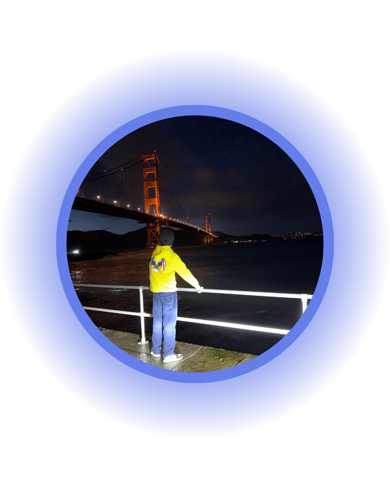
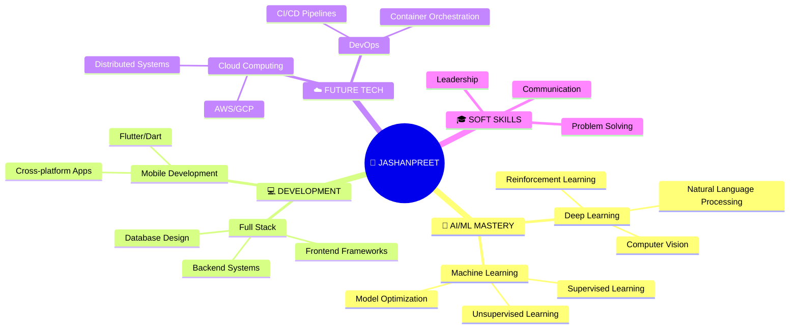

<div align="center">
  
</div>

<!-- Floating Profile Image with Glow Effect -->
<div align="center">
  
</div>

<br>

<!-- Dynamic Typing -->
<!-- NOTE: Removed 'multiline=true' to create a cleaner, single-line typing animation that deletes and re-types each line. -->
<div align="center">
  
</div>

<br>

<!-- Animated Badges with Glow Effects -->
<div align="center">
  
  
  
  
</div>

<br>

---

<!-- Hero Section with Glassmorphism Effect -->
<div align="center">
  
## 🌟 **WELCOME TO MY DIGITAL UNIVERSE** 🌟

*Where Code Meets Creativity and AI Meets Innovation*

</div>

<!-- 3D Card Layout -->
<table align="center">
<tr>
<td width="33%" align="center">
  
  <br><br>
  
  <br>
  <strong>STUDENT INNOVATOR</strong>
  <br>
  <em>Learning, Growing, Building</em>
</td>
<td width="33%" align="center">
  
  <br><br>
  
  <br>
  <strong>MACHINE LEARNING</strong>
  <br>
  <em>Teaching Machines to Think</em>
</td>
<td width="33%" align="center">
  
  <br><br>
  
  <br>
  <strong>DEVELOPER</strong>
  <br>
  <em>End-to-End Solutions</em>
</td>
</tr>
</table>

<br>

---

<!-- Python Code Style About Section -->
<div align="center">
  
## 💻 **SYSTEM.PROFILE.EXECUTE()**

</div>

```python
#!/usr/bin/env python3
# -*- coding: utf-8 -*-

class DigitalSelf:
    def __init__(self):
        self.name = "Jashanpreet Singh"
        self.alias = ["JashanMaan28", "The AI Whisperer", "Code Poet"]
        self.location = "California, USA 🌴"
        self.age = 17
        self.role = "AI Engineer & Innovator"
        self.mission = "Building AI that serves humanity"
        
        # Core Attributes
        self.passion = ["Machine Learning", "Deep Learning", "Innovation"]
        self.superpowers = ["Problem Solving", "Quick Learning", "Creative Thinking"]
        self.current_quest = "Mastering Computer Vision & NLP"
        
        # Stats
        self.projects_completed = 15
        self.models_trained = 8
        self.coffee_consumed = "∞"
        self.bugs_fixed = 500
        
    def get_dream(self):
        return "Creating AI solutions that make the world a better place"
    
    def is_available_for_collaboration(self):
        return True  # Always open to amazing opportunities!
    
    def get_current_status(self):
        return {
            "learning": ["Advanced Deep Learning", "Computer Vision"],
            "building": ["Sign Language Translator", "AI Study Assistant"],
            "planning": ["Next-gen AI Applications"],
            "mood": "🚀 Ready to change the world!"
        }

# Initialize the journey
me = DigitalSelf()
print(f"🎯 Current Mission: {me.get_dream()}")
print(f"🤝 Open for collaboration: {me.is_available_for_collaboration()}")
```

---

<!-- Tech Stack Visualization -->
<div align="center">
  
## ⚡ **TECHNOLOGY ARSENAL** ⚡

*"My weapons of choice for building the future"*

</div>

<!-- AI/ML Section with Glowing Effects -->
<div align="center">
  
### 🧠 **ARTIFICIAL INTELLIGENCE & MACHINE LEARNING**


<br>


</div>

<!-- Programming Languages Grid -->
<div align="center">
  
### 💻 **PROGRAMMING LANGUAGES**

<table>
<tr>
<td align="center" width="20%">
  
  <br>
  <strong>Python</strong>
  <br>
  ⭐⭐⭐⭐⭐
  <br>
  <em>AI/ML Master</em>
</td>
<td align="center" width="20%">
  
  <br>
  <strong>JavaScript</strong>
  <br>
  ⭐⭐
  <br>
  <em>Web Wizard</em>
</td>
<td align="center" width="20%">
  
  <br>
  <strong>HTML/CSS</strong>
  <br>
  ⭐⭐⭐⭐⭐
  <br>
  <em>UI Craftsman</em>
</td>
<td align="center" width="20%">
  
  <br>
  <strong>Dart</strong>
  <br>
  ⭐
  <br>
  <em>Mobile Magic</em>
</td>
</tr>
</table>

</div>

<!-- Development Tools with Effect -->
<div align="center">
  
### 🛠️ **DEVELOPMENT ECOSYSTEM**


<br><br>


</div>

---

<!-- Project Showcase -->
<div align="center">
  
## 🚀 **FLAGSHIP PROJECTS SHOWCASE**

*"Innovation in Action - Projects That Make a Difference"*

</div>

<div align="center">

<table>
<tr>
<td width="50%" align="center">
  
### 🤟 **SIGN LANGUAGE TRANSLATOR**
  


**Real-time ASL Detection & Translation**

🎯 **Mission**: Bridge communication barriers  
🧠 **Tech**: MediaPipe + Random Forest ML  
📊 **Accuracy**: 95%+ detection rate  
👥 **Impact**: Empowering deaf community  

```python
def detect_asl(frame):
    landmarks = extract_hand_landmarks(frame)
    prediction = ml_model.predict(landmarks)
    return translate_to_text(prediction)
```


</td>
<td width="50%" align="center">
  
### 📁 **Auto Local File Sorter**
  


**Smart File Management for Your Desktop**

🧭 **Mission**: Eliminate clutter & boost productivity  
🤖 **Tech**: Python + OS + ML (optional)  
📂 **Features**: Auto-sorts documents, images, media, and more  
⚡ **Speed**: Instant organization on file creation or schedule

```python
class FileSorter:
    def sort_files(self, directory):
        for file in os.listdir(directory):
            category = self.categorize(file)
            self.move_to_folder(file, category)

    def categorize(self, file):
        ext = os.path.splitext(file)[1].lower()
        if ext in ['.jpg', '.png', '.gif']:
            return 'Images'
        elif ext in ['.docx', '.pdf', '.txt']:
            return 'Documents'
        elif ext in ['.mp4', '.mp3']:
            return 'Media'
        else:
            return 'Others'
```


</td>
</tr>
<tr>
<td width="50%" align="center">
  
### 🎨 **DYNAMIC PORTFOLIO**
  


**Next-Gen Web Experience**

✨ **Vision**: Showcase creativity & skills  
🎭 **Design**: Interactive & Responsive  
🚀 **Performance**: Lightning fast  
📱 **Mobile**: First-class experience  

```javascript
const portfolio = {
    design: 'cutting-edge',
    animations: 'smooth-as-silk',
    purpose: 'inspire-and-impress',
    visit: 'jashanpreetsingh.web.app'
};
```


</td>
<td width="50%" align="center">
  
### 🧑‍💼 **Face Recognition Attendance Recorder**
  


**Smart Attendance System with AI**

📸 **Tech**: OpenCV + Face Recognition  
🕒 **Purpose**: Auto attendance tracking  
🗃️ **Database**: CSV / SQLite Logs  
🔐 **Security**: Spoof-resistant recognition  

```python
class AttendanceRecorder:
    def __init__(self):
        self.known_faces = load_known_faces()
        self.log_file = "attendance.csv"

    def recognize_and_log(self, frame):
        faces = detect_faces(frame)
        for face in faces:
            name = match_face(face, self.known_faces)
            log_attendance(name, self.log_file)
```


</td>
</tr>
</table>

</div>

---

<!-- GitHub Analytics with Premium Style -->
<div align="center">
  
## 📊 **GITHUB ANALYTICS DASHBOARD**

*"Data-Driven Development Journey"*

</div>

<!-- Main Stats Row -->
<div align="center">
  
  
</div>

<!-- Streak Stats -->
<div align="center">
  
</div>

<!-- Activity Graph -->
<div align="center">
  
</div>

<!-- Achievement Grid -->
<div align="center">
  
### 🏆 **ACHIEVEMENT UNLOCKED**

<table>
<tr>
<td align="center">
  
  <br><em>Built & Deployed</em>
</td>
<td align="center">
  
  <br><em>Trained & Optimized</em>
</td>
<td align="center">
  
  <br><em>Cups Consumed</em>
</td>
<td align="center">
  
  <br><em>Squashed & Fixed</em>
</td>
</tr>
</table>

</div>

---

<!-- Learning Journey with Progress Animation -->
<div align="center">
  
## 🎯 **LEARNING & GROWTH TRAJECTORY**

*"Continuous Evolution in the World of Technology"*

</div>



<!-- Progress Tracking -->
<div align="center">
  
### 📈 **SKILL PROGRESSION MATRIX**

| 🎯 **Technology Domain** | 📊 **Current Level** | 🚀 **Next Milestone** | 🎯 **Target Mastery** |
|---------------------------|----------------------|------------------------|----------------------|
| **🧠 Deep Learning** | ████████░░ 80% | Advanced Architectures | Neural Network Expert |
| **👁️ Computer Vision** | ██████░░░░ 60% | Real-time Processing | Vision AI Specialist |
| **🗣️ Natural Language Processing** | █████░░░░░ 50% | Transformer Models | Language AI Master |
| **☁️ Cloud Computing** | ███░░░░░░░ 30% | AWS Certification | Cloud Architect |


</div>

---

<!-- Interactive Connection Hub -->
<div align="center">
  
## 🌐 **CONNECT & COLLABORATE HUB**

*"Let's Build the Future Together!"*

</div>

<!-- Hero Connection Section -->
<div align="center">
  
### 🤝 **READY TO CREATE SOMETHING AMAZING?**


</div>

<!-- Contact Grid with Hover Effects -->
<div align="center">

<table>
<tr>
<td align="center" width="25%">
  <a href="https://jashanpreetsingh.web.app" target="_blank">
    
  </a>
  <br><em>Explore My Digital World</em>
</td>
<td align="center" width="25%">
  <a href="mailto:jmaan1337@gmail.com" target="_blank">
    
  </a>
  <br><em>Direct Professional Contact</em>
</td>
<td align="center" width="25%">
  <a href="https://www.instagram.com/jshn_maan28" target="_blank">
    
  </a>
  <br><em>Behind the Scenes</em>
</td>
<td align="center" width="25%">
  <a href="https://t.me/jshn_maan28" target="_blank">
    
  </a>
  <br><em>Instant Communication</em>
</td>
</tr>
</table>

</div>

<!-- What I'm Looking For -->
<div align="center">
  
### 🎯 **CURRENTLY SEEKING**


</div>

---

<!-- Inspirational Quote Section -->
<div align="center">
  
## 💭 **PHILOSOPHY & INSPIRATION**

</div>

<div align="center">
  
</div>

<div align="center">
  
### 🌟 **MY CORE BELIEFS**

> *"The future belongs to those who learn, adapt, and create. Every line of code is a step toward building tomorrow's solutions, and every challenge is an opportunity to grow stronger."*

**🎯 Mission**: *Create AI technology that serves humanity and solves real-world problems*

**💡 Vision**: *A world where intelligent machines and humans collaborate to build a better future*

**⚡ Values**: *Innovation • Integrity • Impact • Inclusion*

</div>

---

<!-- Interactive Fun Section -->
<details align="center">
<summary>🎮 <strong>🎉 CLICK HERE FOR SOME FUN FACTS & EASTER EGGS! 🎉</strong></summary>

<br>

### 🎯 **THE CODING JOURNEY IN NUMBERS**

```
🎂 Started coding at: 15 years old
🚀 First AI project: Sign Language Translator
☕ Coffee to code ratio: 1:3 (sustainable fuel!)
🌙 Favorite coding time: Late night (when the world sleeps, I code)
🎵 Coding playlist: Lo-fi beats + epic soundtracks
🐛 Biggest debugging session: 6 hours (worth every minute!)
💡 Eureka moments per month: ~5 (those "aha!" feelings)
🎯 Current goal: Master Computer Vision by year-end
🏆 Dream achievement: Create AI that changes lives
🌟 Personal motto: "Code today, shape tomorrow"
```

### 🎨 **PERSONALITY MATRIX**

- **🧠 Problem Solver**: Love breaking down complex challenges
- **🎯 Goal-Oriented**: Always working toward the next milestone  
- **🤝 Team Player**: Believe in collaborative innovation
- **📚 Lifelong Learner**: Curiosity is my superpower
- **🚀 Visionary**: Always thinking about what's possible
- **💡 Creative Thinker**: Finding unique solutions to old problems

### 🎪 **RANDOM FUN FACTS**

- 🎮 Can code for 8+ hours straight (with proper breaks!)
- 🧩 Love solving algorithmic puzzles in spare time
- 🎨 Secretly dream of creating AI-generated art
- 🌱 Growing a small indoor plant collection (they're great debugging companions)
- 🎬 Favorite movies: Sci-fi and tech thrillers
- 📖 Currently reading: "Deep Learning" by Ian Goodfellow

</details>

---

<!-- Animated Footer -->
<div align="center">
  
</div>

<!-- Final Message -->
<div align="center">
  
</div>

<div align="center">
  <strong>🌟 "In a world of algorithms, be the one who writes them with purpose!" 🌟</strong>
</div>

<br>

<!-- Made with Love Badge -->
<div align="right">
  
  
</div>
